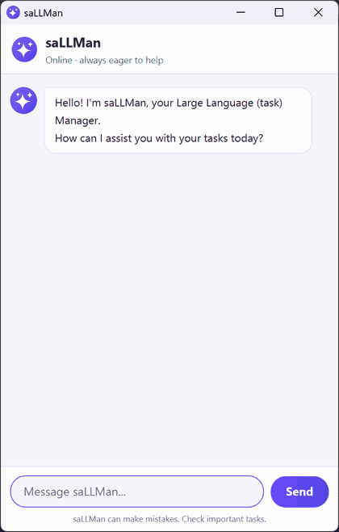

# saLLMan

[](https://github.com/SalmanAlfarisi5/ip/actions/workflows/gradle.yml)

saLLMan is a chatbot that helps you keep track of your tasks:
todos, deadlines and events. Your list is saved to disk automatically and
loaded again the next time you start it.

It has the personality of an over-eager AI assistant. Every task is a
wonderful task, every `list` is a great question, and when you ask for task 99
of 3 it will point out, as a large language model, that there is no task 99.
The replies still say exactly what happened, so the act never gets in the way.



## Download and run

Download `sallman.jar` from the [latest release][latest], put it in an empty
folder, and run it from that folder:

```
java -jar sallman.jar
```

This opens the chatbot's window. Java 25 is the only prerequisite; JavaFX is
bundled inside the JAR, so it does not need to be installed separately. Tasks
are written to `data/sallman.txt` beside the JAR, so run it from a folder you
are happy for it to write into.

[latest]: https://github.com/SalmanAlfarisi5/ip/releases/latest

## Setting up in IntelliJ

Prerequisites: JDK 25, and a recent version of IntelliJ.

1. Open IntelliJ (if you are not in the welcome screen, click `File` >
   `Close Project` to close the existing project first).
1. Open the project into IntelliJ as follows:
   1. Click `Open`.
   1. Select the project directory, and click `OK`.
   1. If there are any further prompts, accept the defaults.
1. Configure the project to use **JDK 25** (not other versions) as explained
   [here](https://www.jetbrains.com/help/idea/sdk.html#set-up-jdk).<br>
   In the same dialog, set the **Project language level** field to the
   `SDK default` option.
1. This project is built with Gradle, so IntelliJ should import it as a Gradle
   project and show a Gradle toolbar with an elephant icon. In
   `File` > `Settings`, set **Gradle JVM** to `Project SDK`.<br>
   If the Gradle toolbar does not appear, close the project, delete the
   `.idea` folder, and open it again so IntelliJ re-imports it.
1. Run the `run` task from the Gradle toolbar, or `./gradlew run` in a
   terminal. If the setup is correct, a saLLMan window opens and greets you:
   "Hello! I'm saLLMan, your Large Language (task) Manager." It looks like
   the screenshot in [`docs/Ui.png`](docs/Ui.png). To see the console version
   instead, see [the text-based interface](#building-and-running-with-gradle)
   below.

**Warning:** Keep the `src/main/java` folder as the root folder for Java files
(i.e., don't rename those folders or move Java files outside that path), as
this is where Gradle expects to find them.

## Building and running with Gradle

Use `gradlew` on Windows and `./gradlew` on macOS and Linux. The wrapper
downloads the right Gradle version on first use, so Gradle does not need to be
installed separately.

| Command | What it does |
|---|---|
| `./gradlew run` | Runs the chatbot's GUI |
| `./gradlew build` | Compiles, tests, and assembles the project |
| `./gradlew test` | Runs the JUnit tests |
| `./gradlew clean` | Deletes the build directory |
| `./gradlew clean shadowJar` | Builds a runnable JAR at `build/libs/sallman.jar` |

Assertions are enabled for `run`, since Java otherwise ignores them.

The text-based interface is still there alongside the GUI, and is what the
text-UI tests drive:

```
java src/main/java/sallman/Sallman.java
```

## Commands

| Command | Example |
|---|---|
| Add a todo | `todo read book` |
| Add a deadline | `deadline return book /by 2019-10-15` |
| Add an event | `event conference /from 2019-10-14 /to 2019-10-17` |
| List everything | `list` |
| List one day | `on 2019-10-15` |
| Mark done / not done | `mark 2`, `unmark 2` |
| Delete | `delete 2` |
| Tag / untag | `tag 2 fun books`, `untag 2 fun` |
| Sort | `sort`, `sort name`, `sort status` |
| Undo the last change | `undo` |
| Exit | `bye` |

Dates are entered as `yyyy-mm-dd` and shown back as `MMM dd yyyy`.

Tags are shown after the task, e.g. `[T][ ] read book #fun #books`. A leading
`#` is optional when typing one, tags are matched without regard to case, and
`find` searches them as well as the description. A tag may contain letters,
digits, hyphens and underscores.

`sort` reorders the list and keeps the new order. A bare `sort` puts the
soonest task first, with undated todos last; `sort name` orders by description
and `sort status` puts unfinished tasks first. Sorting can be undone.

`undo` reverses the last change to the list, and can be repeated to walk back
through the last 20 changes. Only changes made since the chatbot started can
be undone, and a command the chatbot rejected does not count as one.

## Where your tasks are saved

Tasks are written to `data/sallman.txt`, relative to the folder the chatbot is
run from. The file is plain text, one task per line, so it can be read and
edited by hand. A line that cannot be understood is reported and skipped
rather than discarding the rest of the list.

To use a different file, pass it as an argument:

```
./gradlew run --args="path/to/tasks.txt"
```

## Testing

JUnit tests belong in `src/test/java` and run with `./gradlew test`. The
build already declares JUnit 5, so adding a test file there is enough for
Gradle to pick it up.

To see how much of the code the tests reach, run:

```
./gradlew test jacocoTestReport
```

and open `build/reports/jacoco/test/html/index.html`. The GUI is left out of
the report, since it is tested by hand; the rest of the code is covered almost
entirely, and what remains is described in
[`test/manual-testing.md`](test/manual-testing.md). CI publishes the same
report as a `coverage-report` artifact on every push.

There is also a text-UI test plan in [`test/ui-test-plan.md`](test/ui-test-plan.md),
which feeds commands to the chatbot and checks the console output against the
expected transcript. Run it from the repository root with:

```
python test/run-ui-tests.py
```

## Acknowledgements

### Starting point

The project began as the [se-edu Duke template](https://github.com/se-edu/duke)
by Jeffry Lum and Damith C. Rajapakse (see [`CONTRIBUTORS.md`](CONTRIBUTORS.md)).

### Reused code and configuration

- The GUI classes (`Launcher`, `Main`, `MainWindow`, `DialogBox`), their FXML
  layouts, and the JavaFX dependencies in `build.gradle` were first written by
  following the [SE-EDU JavaFX tutorial](https://se-education.org/guides/tutorials/javaFx.html),
  then reworked for this project. Each class notes this in its header comment.
- `config/checkstyle/` is adapted from
  [AddressBook-Level3](https://github.com/se-edu/addressbook-level3).
- `.github/workflows/gradle.yml` started from the
  [se-edu Duke template's workflow](https://github.com/se-edu/duke/blob/full-template/.github/workflows/gradle.yml).

### Third-party libraries and tools

| Library or tool | Used for |
|---|---|
| [JavaFX](https://openjfx.io/) 17.0.7 | the GUI |
| [JUnit](https://junit.org/) 5.14.4 | unit tests |
| [Shadow](https://gradleup.com/shadow/) Gradle plugin 9.5.1 | building the runnable JAR |
| [Checkstyle](https://checkstyle.org/) 11.0.0 | enforcing the coding standard |
| [JaCoCo](https://www.jacoco.org/) 0.8.15 | measuring test coverage |
| [Gradle](https://gradle.org/) 9.6.1 | building the project |

### Use of AI tools

AI tools were used widely in this project by Muhammad Salman Al Farisi.

- **Claude Code** (Anthropic, Claude Opus 5) was used throughout: implementing
  and refactoring increments, including A-MoreErrorHandling, A-BetterGui,
  A-Personality and A-MoreTesting; writing JUnit tests and the text-UI test
  plan; drafting documentation and commit messages; and reviewing code. Recent
  commits made with its help carry a `Co-Authored-By: Claude` line.
- The saLLMan avatar and window icon were drawn by a short program written with
  Claude Code for this project; no existing image was used.
- **OpenAI Codex** reviewed the finished codebase three times, read-only,
  against the course's requirements: twice with model `gpt-5.6-sol`, then once
  more with model `gpt-6-astra` as a final check before submission. Each
  finding was checked
  against the code and the course policies before anything was changed. Those
  that held up were fixed, in commits that say they were found by the review;
  those that did not, such as a claim that credit tags were needed for reusing
  SE-EDU course materials, were not applied.

Code produced with AI was checked with the project's automated tests, the
text-UI test plan, Checkstyle and CI before it was committed.
