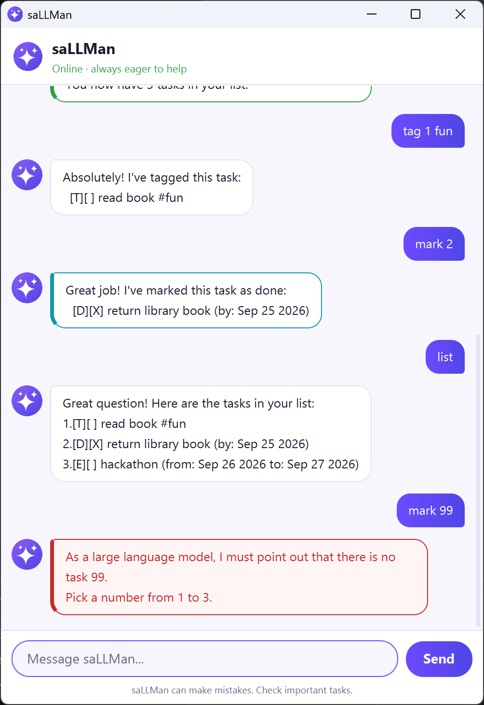

# saLLMan User Guide



**saLLMan** is a desktop chatbot that keeps track of your todos, deadlines and
events. You tell it what to do by typing short commands, and it saves your list
as you go.

It also has the personality of an over-eager AI assistant. Every task is a
wonderful task, and asking for task 99 of 3 gets you a solemn reminder that, as
a large language model, it must point out there is no task 99. The replies
always say exactly what happened, so the act never gets in your way.

- [Quick start](#quick-start)
- [How commands work](#how-commands-work)
- [Features](#features)
- [Your saved data](#your-saved-data)
- [Command summary](#command-summary)

## Quick start

1. Make sure you have **Java 25** installed. You can check by running
   `java -version` in a terminal.
2. Download `sallman.jar` from the
   [latest release](https://github.com/SalmanAlfarisi5/ip/releases/latest).
3. Put the file in an empty folder. saLLMan saves your tasks in that folder.
4. Open a terminal in that folder and run:

   ```
   java -jar sallman.jar
   ```

5. Type a command into the box at the bottom and press **Enter** or **Send**.
   Try these to get started:

   ```
   todo read book
   deadline return library book /by 2026-09-25
   list
   ```

## How commands work

- Words in `UPPER_CASE` are the parts you fill in. In `todo DESCRIPTION`, you
  might type `todo read book`.
- Command words ignore case, so `LIST` and `list` both work.
- Dates are typed as `yyyy-mm-dd`, e.g. `2026-09-25`, and shown back as
  `Sep 25 2026`.
- A task's number is its position in the list shown by `list`. `find` and `on`
  show each task with that same number, so you can use it straight away.
- Markers such as `/by`, `/from` and `/to` need a space on each side, and each
  may be given only once.
- Extra spaces between words are ignored.
- If you mistype a command word, saLLMan suggests the one you probably meant.
  Replies that report a problem are shown in red.

## Features

### Adding a todo: `todo`

Adds a task with no date.

Format: `todo DESCRIPTION`

Example: `todo read book`

saLLMan will not add a task you already have. Tasks count as the same when
they are the same kind, with the same description (ignoring case) and the same
dates.

### Adding a deadline: `deadline`

Adds a task that is due by a date.

Format: `deadline DESCRIPTION /by DATE`

Example: `deadline return library book /by 2026-09-25`

### Adding an event: `event`

Adds an event running from one date to another. The two dates can be the same
day, but the event cannot end before it starts.

Format: `event DESCRIPTION /from DATE /to DATE`

Example: `event hackathon /from 2026-09-26 /to 2026-09-27`

### Listing your tasks: `list`

Shows every task, numbered from 1.

Format: `list`

Each task is shown like this:

```
3.[E][ ] hackathon (from: Sep 26 2026 to: Sep 27 2026) #coding
```

| Part | Meaning |
|---|---|
| `[T]`, `[D]`, `[E]` | a todo, deadline or event |
| `[X]` or `[ ]` | done, or not done yet |
| `#coding` | the task's tags, if it has any |

### Marking a task done or not done: `mark`, `unmark`

Formats: `mark NUMBER`, `unmark NUMBER`

Examples: `mark 2`, `unmark 2`

saLLMan tells you if the task is already in the state you asked for.

### Deleting a task: `delete`

Format: `delete NUMBER`

Example: `delete 3`

### Finding tasks: `find`

Shows the tasks whose description or tags contain what you typed. The search
ignores case, and part of a word is enough.

Format: `find KEYWORD`

Examples: `find book`, `find BOO`

### Seeing what is on a date: `on`

Shows the deadlines due on a date, and the events running on it.

Format: `on DATE`

Example: `on 2026-09-26`

### Tagging a task: `tag`, `untag`

Attaches labels to a task, or removes them. Tags are shown after the task and
can be searched with `find`.

Formats: `tag NUMBER TAG...`, `untag NUMBER TAG...`

Examples: `tag 1 fun books`, `untag 1 books`

- A tag may contain letters, digits, hyphens (`-`) and underscores (`_`).
- The `#` is optional when typing: `tag 1 #fun` works too.
- Tags ignore case, so `Fun` and `fun` are the same tag.

### Sorting your list: `sort`

Puts your list in a new order and keeps it that way.

Formats: `sort`, `sort ORDER`

| Command | Order |
|---|---|
| `sort` or `sort date` | soonest first; todos, which have no date, go last |
| `sort name` | alphabetical by description |
| `sort status` | unfinished tasks first |

An event is placed by the day it starts. Tasks the order cannot separate keep
the order they were already in, so sorting by status after sorting by name
leaves each group in name order.

### Undoing a change: `undo`

Reverses your last change to the list. Repeat it to go back further, up to your
last 20 changes.

Format: `undo`

Only changes made since saLLMan started can be undone, and a command saLLMan
refused does not count as a change.

### Exiting: `bye`

Says goodbye and closes the window.

Format: `bye`

## Your saved data

- saLLMan saves your tasks after every change, in `data/sallman.txt` inside the
  folder you ran it from. There is nothing to save by hand.
- The file is plain text, one task per line, so you can back it up or copy it
  to another computer.
- If you edit the file by hand and a line cannot be read, saLLMan skips that
  line, tells you which one it was when it starts, and loads everything else.
  Save the file as UTF-8 if you add accented letters or other non-English text.
- If the file cannot be read at all, saLLMan says so, starts with an empty
  list, and does not save over the file, so nothing in it is lost. Fix or move
  the file, then start saLLMan again.

## Command summary

| Action | Format | Example |
|---|---|---|
| Add a todo | `todo DESCRIPTION` | `todo read book` |
| Add a deadline | `deadline DESCRIPTION /by DATE` | `deadline return library book /by 2026-09-25` |
| Add an event | `event DESCRIPTION /from DATE /to DATE` | `event hackathon /from 2026-09-26 /to 2026-09-27` |
| List tasks | `list` | `list` |
| Mark done | `mark NUMBER` | `mark 2` |
| Mark not done | `unmark NUMBER` | `unmark 2` |
| Delete | `delete NUMBER` | `delete 3` |
| Find | `find KEYWORD` | `find book` |
| Tasks on a date | `on DATE` | `on 2026-09-26` |
| Tag | `tag NUMBER TAG...` | `tag 1 fun books` |
| Untag | `untag NUMBER TAG...` | `untag 1 books` |
| Sort | `sort` or `sort date` / `name` / `status` | `sort name` |
| Undo | `undo` | `undo` |
| Exit | `bye` | `bye` |
